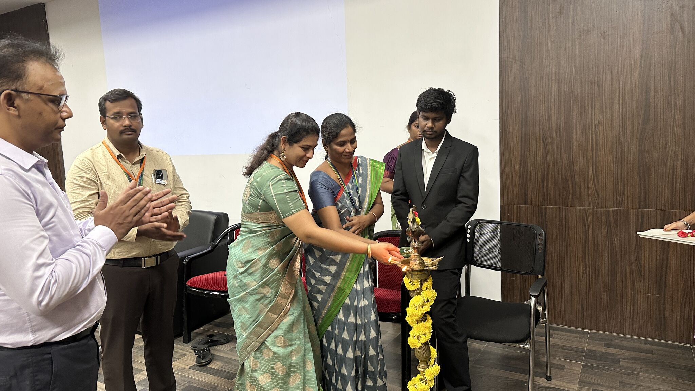

# Past Events

## Inauguration of OWASP Sri Sairam Engineering College Chapter

It’s Official – OWASP Sri Sairam Engineering College Chapter is LIVE! 🚨

On 29.04.2025, we successfully inaugurated the OWASP Sri Sairam Engineering College Chapter — and it was nothing short of amazing! 🎉

The event was graced by the presence of our beloved Heads of Department

Dr.Soma Prathibha , Dr. RAYAVEL PACHAMUTHU and Guests Sriram Kesavan,Manikandan Lakshmanan who lit the traditional lamp to mark the auspicious beginning of this exciting journey.

That moment truly symbolized the light of knowledge we aim to spread through this chapter 🔥🪔

As the Chapter Lead, it was an honor to see so much energy, support, and enthusiasm from students, faculty, and cybersecurity enthusiasts.

💬 This chapter is not just about learning tools —

It’s about building a culture of curiosity, collaboration, and responsible hacking.

A heartfelt thank you to our Principal, faculty members, and everyone who made this possible 🙏

Special shoutout to the entire organizing team for making the launch smooth and impactful 💪

DHARSHAN S P, Vikram Bose MSU

This is just the beginning — stay tuned for workshops, CTFs, speaker sessions, and hands-on cyber adventures 

